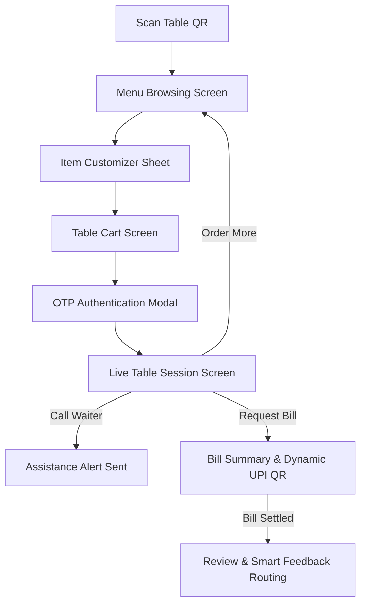
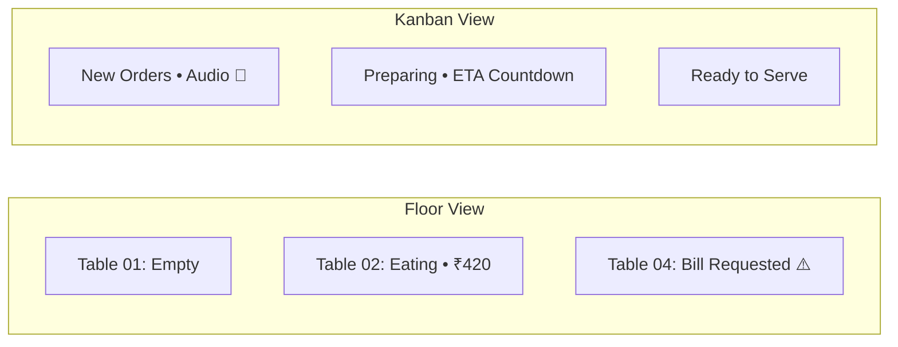
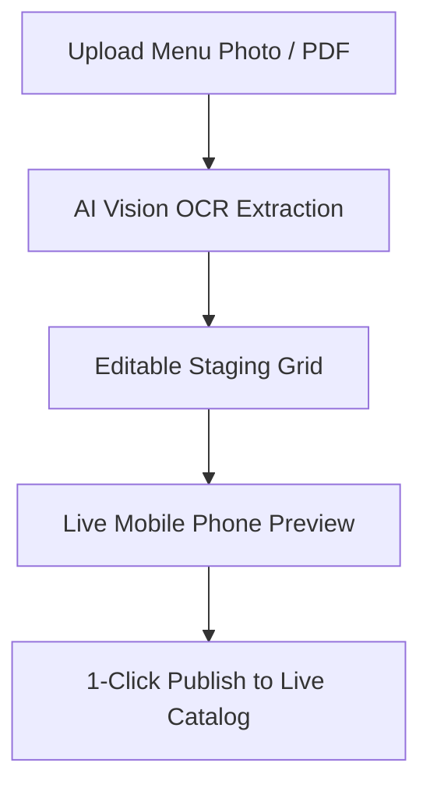
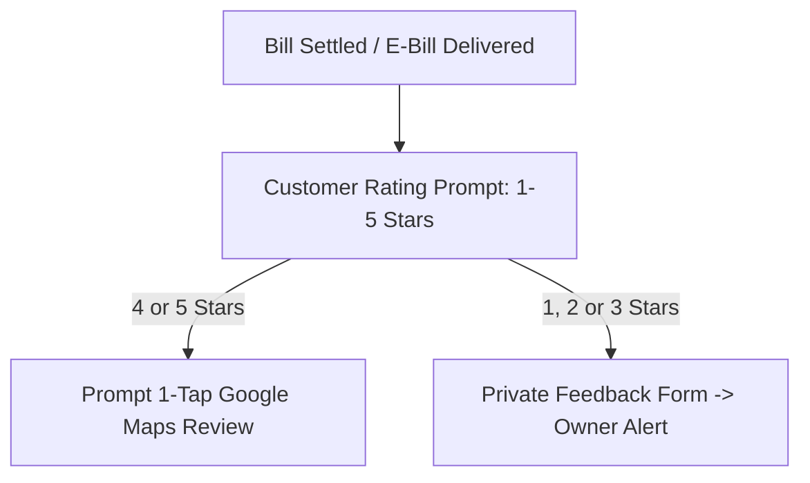

# 12 — Screen-by-Screen UX & Wireframe Flow Map (v1 Master Spec)

This document visualizes the 6 core user and staff journeys for **RestroSarthi** v1. Each flow maps the exact user state, screen elements, primary interactions, error states, and transitions.

---

## 1. Flow 1: Customer Dine-In QR Ordering & Table Session

### Screen 1.1: Menu Browsing (`/v/{slug}/t/{token}`)
* **Header:** Cafe logo, Cafe name, Table Badge ("Table 04"), Veg-only toggle, Search bar.
* **Category Navigation:** Sticky horizontal pill scroll (`Recommended`, `Hot Coffee`, `Cold Brews`, `Artisan Sandwiches`, `Desserts`).
* **Item Cards:** Photo, Veg/Non-Veg icon, Item title, Description, Base price (e.g. ₹180), "ADD" button (or "Out of Stock" greyed pill).
* **Floating Bottom Bar:** Visible when cart > 0 items: "X items • ₹Y | View Cart →".

### Screen 1.2: Item Customization Bottom Sheet
* **Header:** Item photo, title, base price.
* **Variant Selector:** Radio buttons (e.g., `Regular (250ml) - ₹180`, `Large (350ml) - ₹230`).
* **Add-on Groups:** Checkboxes with selection helper tags (e.g., "Choose Milk - Pick 1" `[Oat Milk +₹40]`, `[Almond Milk +₹50]`).
* **Cooking Instructions:** Textarea (max 200 chars, e.g. "Less ice, extra hot").
* **CTA Button:** Sticky button: "Add to Cart • ₹220".

### Screen 1.3: Table Cart Screen
* **Header:** "Your Table Cart (Table 04)".
* **Line Items:** Item name, chosen variant/addons, quantity stepper (`- 1 +`), line total.
* **Coupon Field:** Input code + "Apply" button (shows green discount banner if valid, inline error if invalid).
* **Bill Summary:** Items Subtotal, CGST (2.5%), SGST (2.5%), Grand Total.
* **CTA:** "Place Order • ₹450" (triggers Phone OTP if not logged in).

### Screen 1.4: First-Time Phone OTP Modal
* **Input 1:** Mobile Number (+91 prefilled).
* **Input 2:** Name (optional if returning).
* **Consent:** Pre-checked WhatsApp E-bill & offers checkbox with legal notice.
* **OTP Stepper:** 6-digit boxes with 60s resend cooldown. Auto-advances upon verification.

### Screen 1.5: Live Table Session Screen
* **Status Card:** Live status badge (`Round 1: Preparing • ETA ~12 mins`).
* **Running Tab Summary:** Accordion of all rounds placed at Table 04 with cumulative total.
* **Action Buttons:**
  * Primary Button: `+ Order More Items` (reopens menu attached to same table).
  * Secondary Outlined: `🔔 Call Waiter` (changes to "Waiter Notified" with checkmark).
  * Secondary Outlined: `🧾 Request Bill` (opens instant bill modal).

---

## 2. Flow 2: Dual-Mode Order Desk (Staff POS & Kitchen)

### Screen 2.1: Order Desk Header & Global Controls
* **Top Bar:** Cafe Name, Current Shift Cashier Name, System Clock (IST), "Busy Mode" Toggle Switch (pause QR orders), "+ Quick Punch (Walk-in)" Button, "Day Close" Button.
* **View Switcher:** Segmented control: `Floor Plan (Tables)` | `Kitchen Kanban`.

### Screen 2.2: Live Table Floor Grid View
* **Table Cards (Interactive Tiles):**
  * **Green / Empty:** `Table 01 • Available` (tap to open manual table tab).
  * **Blue / Occupied:** `Table 02 • Seated 35m • 2 Rounds • Total ₹640` (tap opens session drawer).
  * **Flashing Amber / Help:** `Table 03 • 🔔 Waiter Called (2m ago)` (tap to acknowledge).
  * **Flashing Red / Bill:** `Table 04 • 🧾 Bill Requested • ₹890` (tap to settle).

### Screen 2.3: Live Orders Kanban View
* **Column 1: New Orders (Red/Amber):** Pulsing cards with persistent chime.
  * Card elements: Order Code (`#A-12`), Table Number (`Table 04`), Timestamp, Items list with variant details, Diner note ("extra hot").
  * Actions: `Accept (Prefilled ETA: 15m)` | `Reject (Dropdown reason)`.
* **Column 2: Preparing (Blue):**
  * Timer countdown (`08m remaining`). Action: `Mark Ready`.
* **Column 3: Ready (Green):**
  * For Dine-In: `Mark Served`. For Takeaway: Triggers customer pickup notification.

---

## 3. Flow 3: Staff Quick-Punch & Table Settlement (Billing)

### Screen 3.1: Fast-Punch Order Dialog (Walk-ins & Counter)
* **Left Panel (Menu Grid):** Category tabs on top, visual item tiles with prices. Tap item to add to bill slip.
* **Right Panel (Active Bill Slip):**
  * Header: Table Selector dropdown (or "Counter / Takeaway"). Customer phone input.
  * Line items with quantity and price.
  * Discount button (apply % or flat ₹).
  * Actions: `Send to Kitchen (KOT)` | `Instant Settle & Print`.

### Screen 3.2: Table Settlement Drawer
* **Bill Breakdown:** Itemized rounds, Subtotal, Discount line, CGST (2.5%), SGST (2.5%), Round-off, Grand Total in bold.
* **Payment Selector:**
  * `[ Cash ]` -> Prompts cash tendered, displays exact change to return.
  * `[ UPI ]` -> Displays dynamic Cafe UPI QR on customer-facing screen.
  * `[ Card ]` -> Prompts terminal reference.
  * `[ Razorpay ]` -> Sends payment link to customer phone.
* **Action Buttons:**
  * Primary Green: `Settle Bill & Send WhatsApp E-Bill`.
  * Secondary: `🖨️ Print Bill (80mm)`.

---

## 4. Flow 4: AI Menu Builder & Onboarding

### Screen 4.1: AI OCR Staging Grid
* **Upload Dropzone:** Drag & drop paper menu photos (JPG, PNG) or menu PDF.
* **Processing Indicator:** "AI is extracting items, categories, and prices (estimated 4s)..."
* **Review Grid:**
  * Columns: Category, Item Name, Veg/Non-Veg icon, Price (₹), Description.
  * Confidence Flags: Items with unreadable text highlighted in soft yellow.
  * 1-click tools: Add Category, Bulk Change Tax, Delete Row.
* **Side-by-Side Mobile Simulator:** Interactive preview updating live as rows are edited in the grid.
* **Bottom Bar:** "Approve & Import 54 Items to Menu →".

---

## 5. Flow 5: WhatsApp Retention & Attributed Revenue Ledger

### Screen 5.1: Retention Dashboard & Revenue Ledger
* **Hero Tile (The SaaS Retention Spine):**
  * `₹42,800 Attributed Revenue this Month` (`Generated from 118 repeat orders`).
* **Active Automated Triggers:**
  * *Post-First-Visit Thank You:* `Active` (Sent: 142 | Claimed: 28 | Rev: ₹9,400).
  * *Birthday Greetings:* `Active` (Sent: 18 | Claimed: 7 | Rev: ₹3,100).
  * *30-Day Win-Back:* `Active` (Sent: 85 | Claimed: 14 | Rev: ₹5,800).
* **Launch Campaign Button:** Opens broadcast composer.

### Screen 5.2: Manual Broadcast Campaign Composer
* **Step 1: Select Audience Segment:**
  * Radio options with live audience counts: `All Customers (620)`, `New (210)`, `Repeat (180)`, `Loyal (85)`, `At-Risk (145)`.
* **Step 2: Choose Approved Meta Template:**
  * Card selection (e.g. "Weekend Feast Discount", "Festive Treat", "Chef's Special").
* **Step 3: Fill Variables:**
  * Inputs: Offer Title ("Flat 20% Off"), Expiry Date picker.
* **Step 4: Safety & Quota Check:**
  * Pre-send audit shows: "Targeted: 145 • Estimated sends after weekly caps: 128 • Estimated cost: ₹110".
* **CTA:** `Send Campaign Now` (dispatches to BullMQ background queue).

---

## 6. Flow 6: Smart Review & Reputation Routing

### Screen 6.1: Customer Review Prompt (PWA / E-Bill Link)
* **Prompt:** "How was your experience at {Cafe Name} today?"
* **Star Selector:** 5 interactive Gold Stars.

### Screen 6.2A: 4 or 5 Stars Selected (Positive Path)
* **Message:** "We're thrilled you enjoyed your visit! ⭐"
* **Primary Action:** `🌟 Share on Google Maps (Takes 5 seconds)`
  * Tapping opens native Google Maps review dialog for the cafe's exact Place ID.

### Screen 6.2B: 1, 2 or 3 Stars Selected (Recovery Path)
* **Message:** "We're sorry we fell short. Please let our management know what went wrong."
* **Form:** Multi-select chips (`Food Quality`, `Service Speed`, `Cleanliness`, `Pricing`) + feedback comment box.
* **Submit Action:** Sends an instant internal alert to the Cafe Owner dashboard to address the grievance privately.
